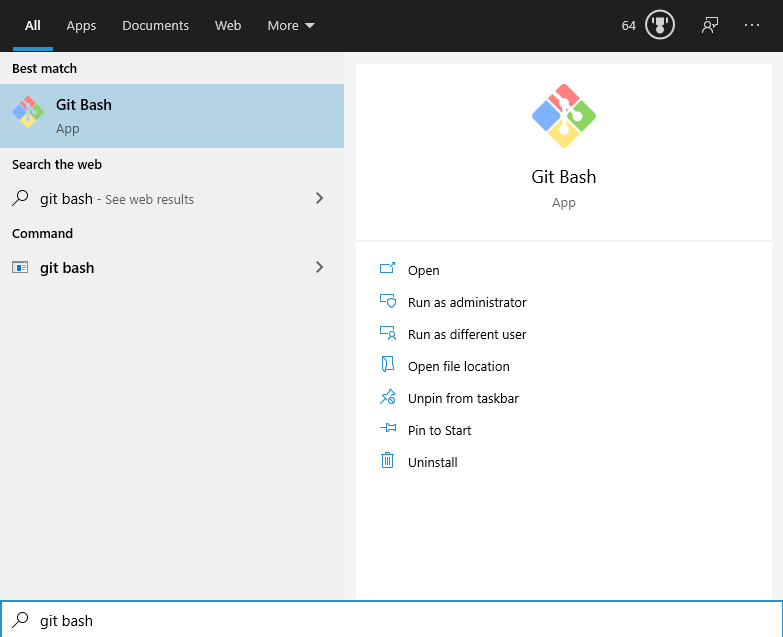
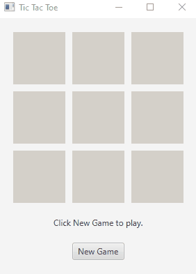

# Tic Tac Toe Game

I wrote this for a final project in Programming Fundamentals II. It's a simple Tic Tac Toe game that plays itself using random numbers and calculates the results. Originally written and compiled using Java 8 from Oracle. Without modification it should compile and run using the latest OpenJDK and Open JavaFX packages.

## Compile and Run Instructions

### Windows

1. Install [Git for Windows](https://gitforwindows.org/)

2. Open **Git Bash**

  
  
3. Run the following commands to setup envrionment.

```bash
cd

git clone https://github.com/clintmint/TicTacToe.git

cd TicTacToe

curl -o openjdk-14.0.1_windows-x64_bin.zip https://download.java.net/java/GA/jdk14.0.1/664493ef4a6946b186ff29eb326336a2/7/GPL/openjdk-14.0.1_windows-x64_bin.zip
curl -o openjfx-14.0.1_windows-x64_bin-sdk.zip https://download2.gluonhq.com/openjfx/14.0.1/openjfx-14.0.1_windows-x64_bin-sdk.zip

unzip openjdk-14.0.1_windows-x64_bin.zip
unzip openjfx-14.0.1_windows-x64_bin-sdk.zip

export PATH=$HOME/TicTacToe/jdk-14.0.1/bin/:$PATH
export PATH_TO_FX=$HOME/TicTacToe/javafx-sdk-14.0.1/lib/
```

4. Verify versions are 14.x

```bash
java -version
javac -version
```

5. Compile & Run

```bash
javac --module-path $PATH_TO_FX --add-modules javafx.controls TicTacToe.java
java --module-path $PATH_TO_FX --add-modules javafx.controls TicTacToe
```

  

### Linux

1. Clone 

```bash
cd

git clone https://github.com/clintmint/TicTacToe.git

cd TicTacToe
```

2. Install OpenJDK and OpenJFX using package manager then configure openjfx library path.

```bash
sudo apt install openjdk-17-jdk openjfx

export PATH_TO_FX=/usr/share/openjfx/lib
```

3. Compile & Run

```bash
javac --module-path $PATH_TO_FX --add-modules javafx.controls TicTacToe.java
java --module-path $PATH_TO_FX --add-modules javafx.controls TicTacToe
```


